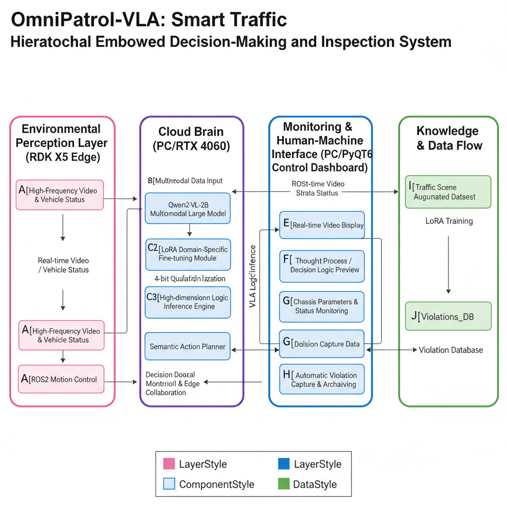

# 🚓 OmniPatrol-VLA 
### 基于 Qwen2-VL 与 ROS2 的智慧交通分层具身决策巡检系统

[](https://www.python.org/)
[](https://pytorch.org/)
[](https://huggingface.co/Qwen/Qwen2-VL-2B-Instruct)
[](https://developer.horizon.cc/)

> **"让巡检机器人从‘目标检测’进化为‘逻辑理解’。"**
> 本项目通过 VLA (Vision-Language-Action) 架构，实现了从视觉感知到交通规制理解，再到动作决策的全链路闭环。

---

## 💡 项目亮点 (Highlights)

- **🧠 强大的“云端大脑”**：基于 **Qwen2-VL-2B** 多模态大模型，通过 **4-bit 量化** 部署于 RTX 4060。相比传统 YOLO，它能理解“车轮压线”、“违规占用”等复杂的几何逻辑。
- **🔬 LoRA 垂直领域微调**：针对交通场景进行专项训练，Loss 降至 **0.2**，确保模型输出极度稳定的结构化 JSON 指令。
- **🤖 分层具身架构**：
  - **大脑 (Brain)**：PC 端负责高维逻辑研判与语义动作生成。
  - **小脑 (Cerebellum)**：RDK X5 边缘端负责 ROS2 运动控制与高频视频采集。
- **🖥️ 极客风监控终端**：基于 **PyQt6** 独立开发的深色系 UI，集成了实时视频流、思维流预览、底盘参数显示及自动违章抓拍功能。

---

## 🛠️ 系统架构 (Architecture)




---

## 🚀 快速开始 (Quick Start)

### 1. 环境准备
```bash
# 创建并激活环境
conda create -n omnipatrol python=3.10
conda activate omnipatrol

# 安装核心依赖
pip install transformers accelerate bitsandbytes peft qwen-vl-utils
pip install fastapi uvicorn requests opencv-python PyQt6
```

### 2. 启动大脑服务端 (PC 端)
```bash
python vla_server.py
```
*大脑将加载 4-bit 量化模型，并在 8001 端口等待接入。*

### 3. 开启智控大屏 (PC 端)
```bash
python omni_dash_pro.py
```
*在界面中点击“连接摄像头”和“启动巡检”即可进入自动化办公模式。*

### 4. 机器人终端执行 (RDK X5 端)
```bash
python rdk_client.py
```

---

## 📺 效果展示 (Demo)

| 实时巡检界面 | 违章自动取证 |
| :---: | :---: |
|  |  |

- **正常状态**：绿色 UI，机器人保持巡航速度。
- **发现违章**：UI 瞬间爆红，Thought 框输出分析逻辑，系统自动抓拍并存档。

---

## 📂 项目结构 (Repository Structure)

```text
OmniPatrol-VLA/
├── vla_server.py          # 基于 FastAPI 的 VLA 大脑服务端
├── omni_dash_pro.py       # 基于 PyQt6 的极客监控大屏
├── rdk_client.py          # RDK X5 边缘端采集脚本
├── finetune/              # LoRA 微调相关数据集与配置
│   ├── data/              # 1000+ 交通场景增强数据集
│   └── train_qwen.yaml    # 4060 专属训练参数
└── Violations_DB/         # 自动抓拍的违章图片库
```

---

## 🛡️ 开源协议 (License)
本项目采用 MIT License 开源。

---

**✍️ 开发者说**：这是一个从 0 到 1 独立开发的具身智能探索项目。如果你觉得这个思路对你有帮助，欢迎点个 ⭐ **Star** 支持一下！
```